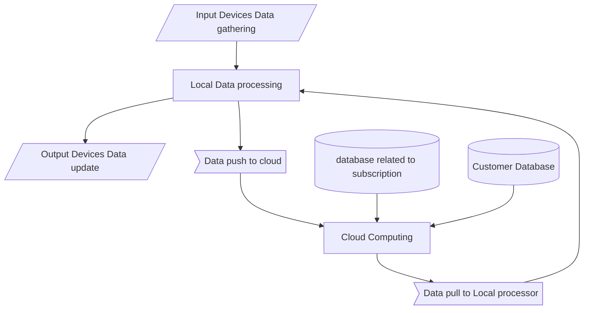
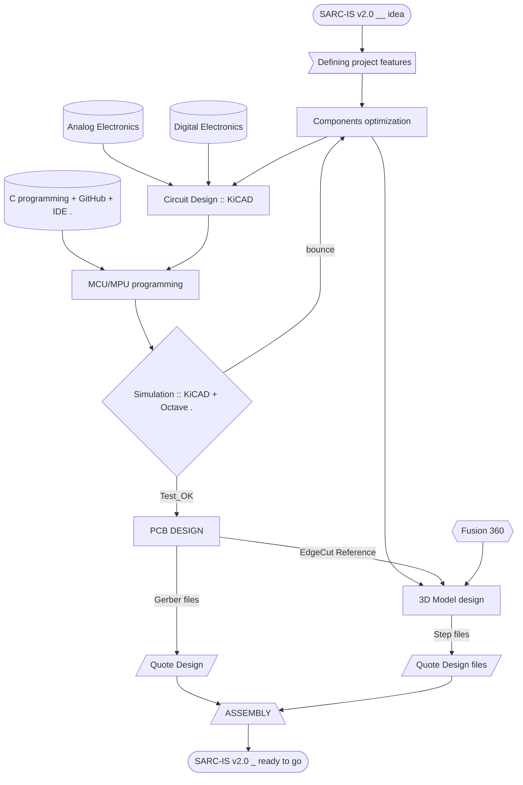

# Nico The Robot
## ABSTRACT

Nico v1.0 is an AI powered Multi-purpose Modular Robot. Nico hardware is a minimal and affordable design. The MCU/MPU is designed to perform Critical Tasks. The main AI computation is performed at Cloud. Which makes it affordable and modular.

Nico can be used as a personal assistant, teacher, kids companion, Security guard and a lot more. It Works in a subscription manner. Customers pick subscriptions based on their interest.

Nico comprises a lot of Reliable sensors including mic,camera,thermal sensors,pressure,gyro, accelerometers ..etc. which can monitor the current status and assistance for a paralised or disabled man. They make sure Nico is provided with all the Necessary data which needs to be processed within the cloud.

The data is processed based on the Subscription.
 
## Target features:

+ Route mapping and learning
+ Sensors (humidity,temperature,ambient,ir,signal,hall, ..etc)
+ GyroStabilization
+ Camera object Recognition
+ Threat detection, collision avoidance
+ Obstacle ranging (either by using ToF or by Radar)
+ Thermal cam/sensor
+ 5g LTE
+ Cloud computing
+ Voice iN (NLP)
+ Voice OUt (synthesis and broadcast)
+ Battery Management System

## HardWare parts :

- Radar -- > D3Eng-AutoRadar-Modules
- Acconeer(XM132) radar Sensor module
- ToF proximity Multi Object ---> VL53L
- NLP  ----> 4-ch digital audio ADC with integrated mic bias
- NLP chip
- Processing in STM32
- MicroProcessor -- STM32MP157f
- Op Amp    ---> MCP6D11
- PowerControllerIcDC2DC ---> AN216
- USBportPowered_Li-ion/Li-po Charging ---> AN971 ,, TypeC_Conn_reference
- MEMS_6axis_intertial_module  ---> ASM330LHH
- BLE+WiFi ----> ESP32

## Resources to learn:
- MIT pdf notebook(basic radar tech)
- Acconeer Software Tools

## Software & Tools Required:
+ GitHub
+ KiCad
+ STM32cubeIDE
+ AWS
+ Fusion360
+ SoftwareDev.IDE (any)
+ DBMS
+ WebDev.
+ Python_OOP
+ 
+ Design Features :
+ All-metal chassis
+ Modular components

## Electromechanical components :
+ BLDC motor/Stepper motor
+ Linear Servo
+ 
+ Highlights:
+ 
+ Health Care (caretaker)
	1. For Dissabled

2. for Childrens
1. For Autism
1. Senior citizen
+ Security
	- Burglar
	- Electricity
	- Mechanical moving Devices
+ Teacher/mentor (incl. Autism)
	- Task Related Learning
+ Personal Assistant
+ Household maintenance
+ Emergency Reporting
+ Customer support

## Model Workflow

## Project Workflow

## Components Required

Components :

+ Lenevo webcam
+ Robotc car chassy
+ Battery pack
+ Motor driver
+ Mq2
+ Gluegun
+ 3.5mm headphone jack
+ Raspberry pi 4 8gb
+ Knife blade soldering paste lead
+ Pulse  oximeter
+ Lcd display
+ Connecting wires
+ Leds + white light
+ Buck converter
+ mpu6050
+ Servos
+ Robotic arms
+ Ultrasonic array
+ dht11
+ Audio amplifier
+ Soldering iron
+ Speaker
+ Microphone module —-
+ Raspberry cooler fan
+ Pir * 3
+ Buzzer
+ Heat shrink tube

# flow chart

~~~mermaid
graph TD:

~~~
